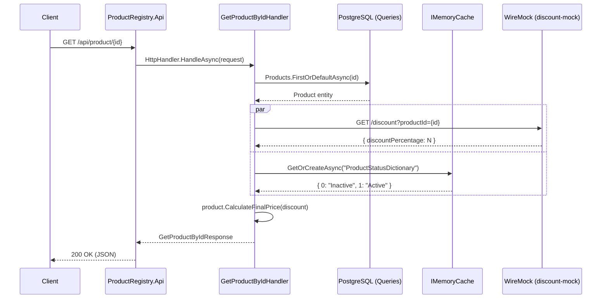

# 🗂️ Product Registry — TDD PoC

API REST en .NET 10 para gestionar un catálogo de productos. Sirve como prueba de concepto técnica que combina **Clean Architecture**, patrones de diseño bien definidos y un entorno completamente autocontenido con Docker Compose.

---

## Arquitectura

El proyecto sigue una arquitectura en capas con dependencias que fluyen hacia adentro:

```
ProductRegistry.Api          ← Capa de presentación (Minimal API)
    └── ProductRegistry.Application  ← Casos de uso, contratos
            └── ProductRegistry.Domain       ← Entidades, enums, interfaces de repositorio
ProductRegistry.Infrastructure          ← EF Core, HttpClient, repositorios
```

> **Regla de dependencias:** `Infrastructure` y `Api` conocen a `Application`/`Domain`, pero nunca al revés.

---

## Patrones y decisiones técnicas

### `DotEmilu` — librería propia

Todas las abstracciones core del pipeline de handlers provienen de esta librería interna:

| Abstracción                        | Rol                                                                        |
|------------------------------------|----------------------------------------------------------------------------|
| `Handler<TReq, TRes>`              | Clase base de cada caso de uso. Orquesta validación → ejecución.           |
| `IVerifier<T>`                     | Ejecuta las `AbstractValidator<T>` de FluentValidation y acumula errores.  |
| `HttpHandler<TReq, TRes>`          | Adapter para inyectar el handler en la Minimal API.                        |
| `AsDelegate`                       | Factory de delegates para los endpoints, evitando boilerplate.             |
| `IContextUser<Guid>`               | Contrato para obtener el usuario autenticado (usado por los interceptors). |
| `AddHandlers` / `AddChainHandlers` | Registro automático de handlers por assembly.                              |

### CQRS lite (Commands / Queries)

Los repositorios están separados en dos contratos del dominio:

- `IQueries` → `Queries` (EF Core con `NoTracking`, solo lecturas)
- `ICommands` → `Commands` + `IUnitOfWork` (tracking activado, escrituras + `SaveChanges`)

```csharp
// Domain
public interface ICommands : IEntities, IUnitOfWork;
public interface IQueries : IEntities;
```

### Interceptors EF Core

Registrados vía la extensión `AddSoftDeleteInterceptor()` y `AddAuditableEntityInterceptors()` de `DotEmilu.EntityFrameworkCore`. Se encargan automáticamente de:

- **Soft delete** — filtra registros eliminados lógicamente.
- **Auditoría** — rellena `CreatedAt`, `UpdatedAt` y `CreatedBy` / `UpdatedBy` usando `ContextUser` (claim `NameIdentifier`).

### FluentValidation + RFC Problem Details

Cada request tiene su `AbstractValidator<T>`. El `IVerifier` los ejecuta antes de llamar a `HandleUseCaseAsync`. Cuando la validación falla, la librería devuelve automáticamente una respuesta que cumple con **RFC 9457 (Problem Details)**:

```json
{
  "type": "https://tools.ietf.org/html/rfc9457",
  "title": "Bad Request",
  "status": 400,
  "detail": "One or more errors",
  "errors": { "name": ["El nombre es requerido."] }
}
```

Los errores de servidor también devuelven Problem Details (`500`).

### Serilog

Configuración completa desde `appsettings.json` con sink asíncrono doble:

- **Console** — útil en contenedor/dev.
- **File** — rolling diario en `Logs/app-.log`, límite 20 MB, retención 7 días.

El middleware `UseSerilogRequestLogging` enriquece cada request con el nivel correcto:

| Condición               | Nivel         |
|-------------------------|---------------|
| Excepción no controlada | `Error`       |
| Respuesta > 60 s        | `Warning`     |
| 2xx                     | `Information` |
| 4xx                     | `Warning`     |
| 5xx                     | `Error`       |

---

## Flujo del endpoint `GET /api/product/{id}` con WireMock

En desarrollo, el servicio externo de descuentos es simulado por **WireMock** (sin dependencia de internet ni de ningún servicio real).



> WireMock responde con un porcentaje de descuento aleatorio (Handlebars: `{{randomInt lower=0 upper=100}}`), lo que permite probar el cálculo del precio final sin ningún servicio externo real.

---

## Levantar el proyecto

Todo corre de forma **nativa en Docker Compose**: la base de datos PostgreSQL, el mock de descuentos (WireMock) y la API misma. No se necesita nada instalado localmente salvo Docker.

```bash
# Desde la raíz del repositorio
docker compose -f compose.yaml -f compose.override.yaml up --build
```

El `compose.override.yaml` expone los puertos locales y configura las variables de entorno para el entorno `Development`. Al iniciar en modo Development, la API aplica las migraciones de EF Core automáticamente.

| Servicio               | Puerto local (override) | Puerto interno |
|------------------------|-------------------------|----------------|
| `product-registry-api` | `5566`                  | `8080`         |
| `product-registry-db`  | `5433`                  | `5432`         |
| `discount-mock`        | `9090`                  | `8080`         |

**Swagger UI:** `http://localhost:5566/swagger`

> ⚠️ **Conflicto de puertos:** Si algún puerto ya está en uso en tu máquina, edita `compose.override.yaml` y cambia solo la parte **izquierda** del mapeo (el puerto del host). Ejemplo: `"5567:8080"` para la API.

---

## Stack

| Tecnología                     | Uso                                                                                     |
|--------------------------------|-----------------------------------------------------------------------------------------|
| .NET 10 / C#                   | Runtime y lenguaje                                                                      |
| ASP.NET Core Minimal API       | Endpoints REST                                                                          |
| Entity Framework Core + Npgsql | ORM + PostgreSQL                                                                        |
| FluentValidation               | Validación de requests                                                                  |
| Serilog                        | Logging estructurado                                                                    |
| WireMock (via Docker)          | Mock del servicio de descuentos                                                         |
| Docker Compose                 | Entorno autocontenido                                                                   |
| `DotEmilu`                     | Librería propia con abstracciones de handler pipeline, interceptors EF Core y utilities |
